# 1. Wal
## 1.1 Параметры WAL

```postgresql
SHOW wal_level;
SHOW synchronous_commit;
SHOW max_wal_size;
SHOW min_wal_size;
SHOW wal_compression;
SHOW checkpoint_timeout;
SHOW checkpoint_completion_target;
SHOW archive_mode;
SHOW archive_command;
```

- **wal_level**: Определяет объем записываемой информации в WAL. Значение replica позволяет записывать достаточно данных для поддержки архивирования WAL и репликации.
- **synchronous_commit**: Отвечает за то, будет ли сервер ждать физической записи WAL на диск, прежде чем сообщить клиенту об успешном завершении транзакции. 
- **max_wal_size**: Указывает максимальный размер, до которого могут раздуться файлы WAL между контрольными точками (checkpoints). Превышение этого лимита вызывает принудительный checkpoint.
- **min_wal_size**: Минимальный объем файлов WAL, которые Postgres удерживает на диске для повторного использования (чтобы не тратить ресурсы на создание новых файлов).
- **wal_compression**: При включении этого параметра Postgres сжимает полностраничные записи в WAL, что экономит место на диске за счет небольшой нагрузки на CPU.
- **checkpoint_timeout**: Максимальное время между автоматическими контрольными точками. Обычно составляет 5 минут.
- **checkpoint_completion_target**: Задает целевое время завершения контрольной точки. Значение 0.9 означает, что база будет распределять запись данных на 90% времени интервала, чтобы избежать резких скачков нагрузки на диск.
- **archive_mode**: Включает режим передачи заполненных сегментов WAL в архивное хранилище (необходимо для создания бэкапов PITR).
- **archive_command**: Системная команда, которая выполняется для копирования сегмента WAL в архив.

## 1.2. Наблюдение за WAL

```postgresql
select pg_current_wal_lsn() AS lsn
     , pg_walfile_name(pg_current_wal_lsn()) AS wal_filename
```
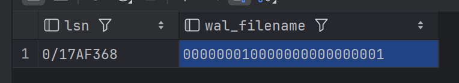
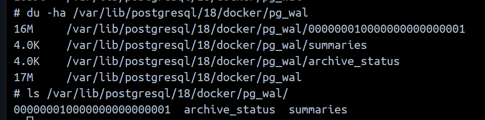

После заполнения:
```postgresql
insert into test(data)
select repeat('a', 100000)
from generate_series(1, 500000);
```
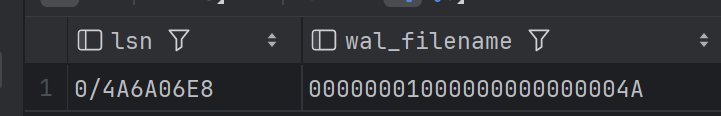
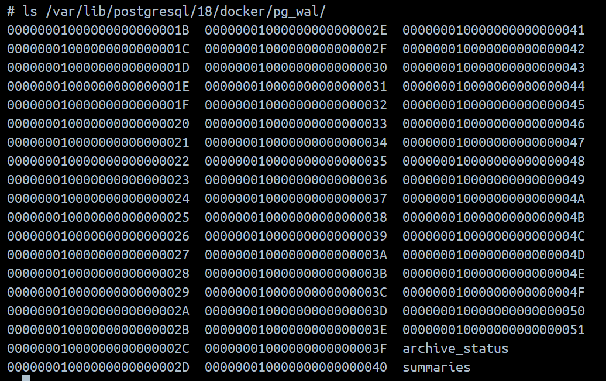

 После выполнения вставки данных значение LSN увеличилось, а имя текущего WAL-файла изменилось. В каталоге pg_wal появились новые сегменты. Это произошло потому, что PostgreSQL работает по принципу Write-Ahead Logging: любые изменения данных сначала записываются в журнал транзакций на диске. Поскольку объем вставленных данных превысил стандартный размер одного сегмента, текущий файл WAL заполнился и система автоматически переключилась на запись в следующий файл, чтобы гарантировать возможность восстановления данных в случае сбоя.

# 2. Чекпоинты
## 2.1 Наблюдение за статистикой чекпоинтов
```postgresql
INSERT INTO test(data)
SELECT repeat('b', 100000)
FROM generate_series(1, 1000);

select * from pg_stat_checkpointer;
select pg_current_wal_lsn() AS lsn
     , pg_walfile_name(pg_current_wal_lsn()) AS wal_filename;
```
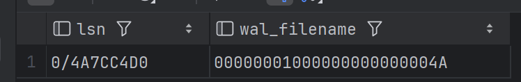
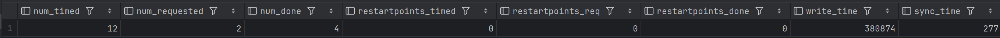
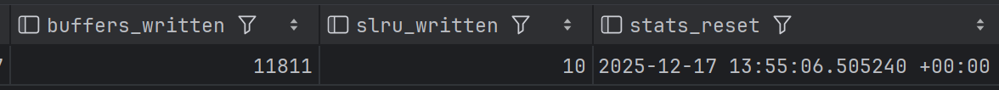

```postgresql
checkpoint;

select * from pg_stat_checkpointer;
select pg_current_wal_lsn() AS lsn
     , pg_walfile_name(pg_current_wal_lsn()) AS wal_filename;
```
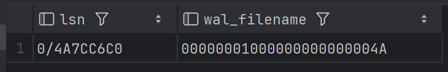
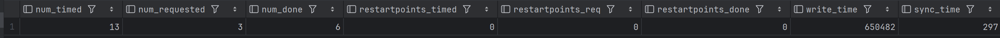
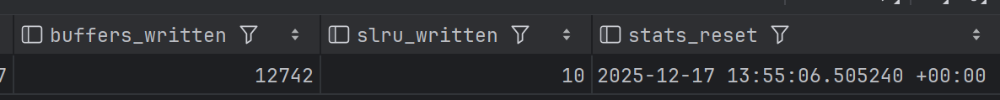

Можно заметить, что в значение в `num_requested` увеличилось на 1

## 2.2 Автоматические чекпоинты(По желанию)

Уменьшение параметра checkpoint_timeout приводит к тому, что контрольные точки создаются чаще. Это увеличивает частоту чекпоинтов, из-за чего нагрузка на диск становится более равномерной, но постоянной, так как база чаще сбрасывает измененные страницы на диск. При этом объем WAL-файлов, необходимых для хранения между чекпоинтами, уменьшается, так как старые записи в журнале быстрее помечаются как выполненные и могут быть удалены или переиспользованы. Сокращение времени восстановления после сбоя: поскольку данные сбрасываются на диск чаще, при аварийной перезагрузке системе придется проигрывать гораздо меньший объем записей из WAL-журнала

# 3. Бэкапы и восстановление
## 3.1 pg_basebackup
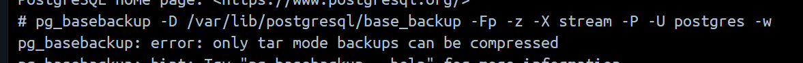

В PostgreSQL утилита pg_basebackup умеет сжимать данные только тогда, когда она упаковывает их в архив. Она не может создать обычную папку с файлами и одновременно их сжать, так как файлы внутри папки базы данных должны оставаться в своем исходном (несжатом) виде, чтобы база могла с ними работать.

Поэтому используем без сжатия:

```bash
pg_basebackup -D /var/lib/postgresql/base_backup -Fp -X stream -P -U postgres -w
```

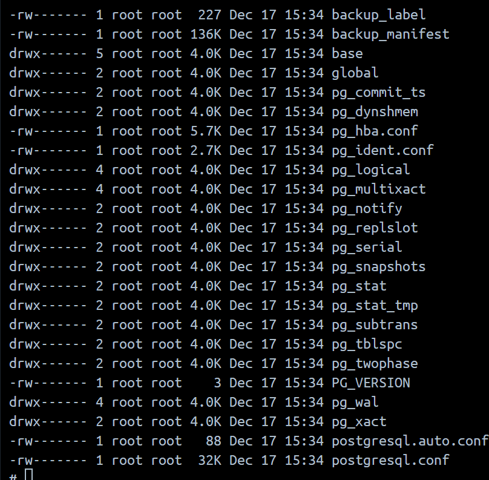

Использование ключа -X stream позволило включить в бэкап все логи транзакций (WAL), созданные в процессе копирования, что гарантирует целостность данных при восстановлении. Выбранный формат вывода -Fp (plain) создал копию в виде обычной структуры директорий, что отличается от формата -Ft (tar), который упаковывает данные в архивы для более удобной транспортировки.

## 3.2 pg_dump

```bash
  pg_dump -Fc -d postgres -f /var/lib/postgresql/backup.dump -U postgres -w
```
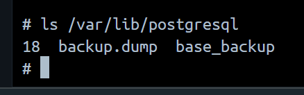
Разница между подходами заключается в уровне копирования данных. Физический бэкап (pg_basebackup) работает на уровне файлов операционной системы, копируя физические блоки данных. Его главный минус — привязка к конкретной версии СУБД и архитектуре ОС. Логический бэкап (pg_dump), напротив, извлекает данные в виде SQL-команд или структурированного архива. Это позволяет восстанавливать отдельные объекты базы, а также переносить данные между разными версиями PostgreSQL или даже разными операционными системами, хотя процесс восстановления занимает значительно больше времени из-за необходимости пересоздания индексов и повторного выполнения транзакций.

## 3.3 Восстановление логического бэкапа
Количество данных до изменения 
```postgresql
SELECT count(*) FROM test;
```
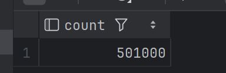

Количество данных после изменения:
```postgresql
INSERT INTO test(data)
SELECT repeat('b', 100000)
FROM generate_series(1, 10000);

SELECT count(*) FROM test;
```
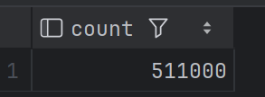

Делаем бэкап:

```postgresql
create database postgres_restored;
```

```bash
pg_restore -d postgres_restored /var/lib/postgresql/backup.dump
```
После этого снова:
```postgresql
SELECT count(*) FROM test;
```
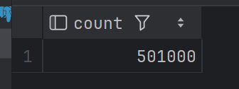

Очевидно, что записей, которые были созданы после создания бэкапа нет.

## 3.4 Восстановление логического бэкапа

Вот готовый текст в формате Markdown, который ты можешь просто скопировать и вставить в свой отчет.

---

## 3.4 Физический бэкап и алгоритм восстановления

**Физический бэкап** — это полная копия всех файлов, из которых состоит база данных на диске.

### Алгоритм восстановления из физического бэкапа

1. **Остановка сервера:** Перед началом работ необходимо полностью остановить работающий экземпляр PostgreSQL, чтобы исключить повреждение файлов.
2. **Подготовка директории:** Текущую папку с данными следует переместить или переименовать, а на её месте создать новую пустую папку с корректными правами доступа для пользователя.
3. **Развертывание данных:** Файлы из бэкапа копируются в подготовленную директорию данных.
4. **Удаление неактуальных WAL:** Файлы из папки `pg_wal/`, попавшие туда вместе с бэкапом, рекомендуется удалить, чтобы сервер мог начать процесс восстановления на основе актуальных журналов.
5. **Создание файла-сигнала:** В корневой папке данных необходимо создать пустой файл с именем `recovery.signal`. Файл сообщает серверу, что запуск должен пройти в режиме восстановления.
6. **Настройка параметров восстановления:** Если требуется восстановление на конкретный момент времени, параметры `restore_command` и `recovery_target_time` прописываются в файле `postgresql.conf`.
7. **Запуск сервера:** После запуска PostgreSQL прочтет журналы транзакций, применит изменения до точки согласованности, после чего удалит файл `recovery.signal` и станет доступен для работы.


